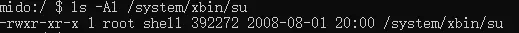
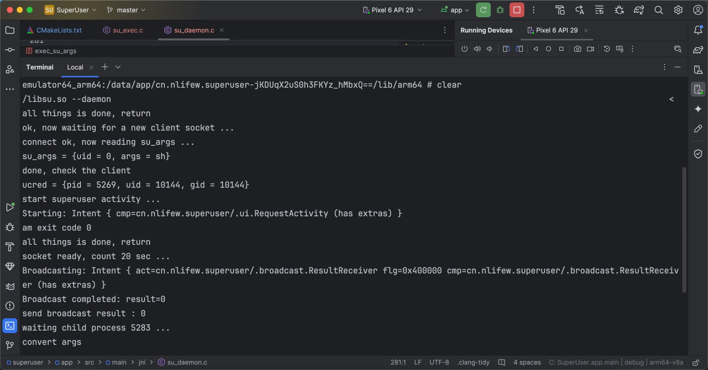
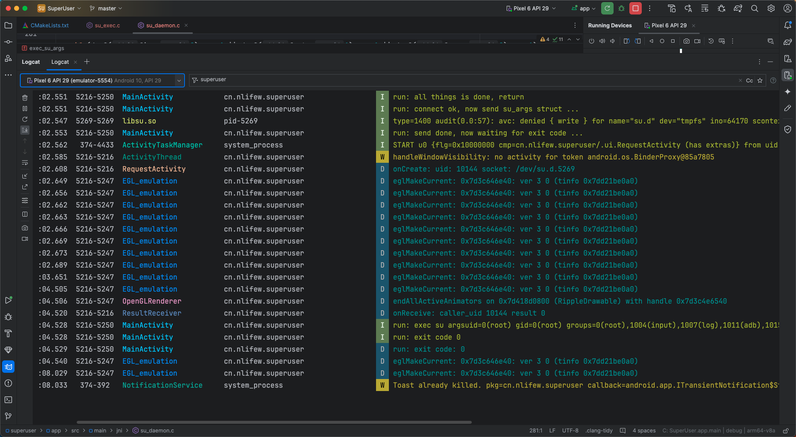
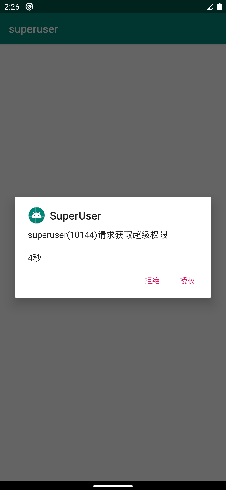
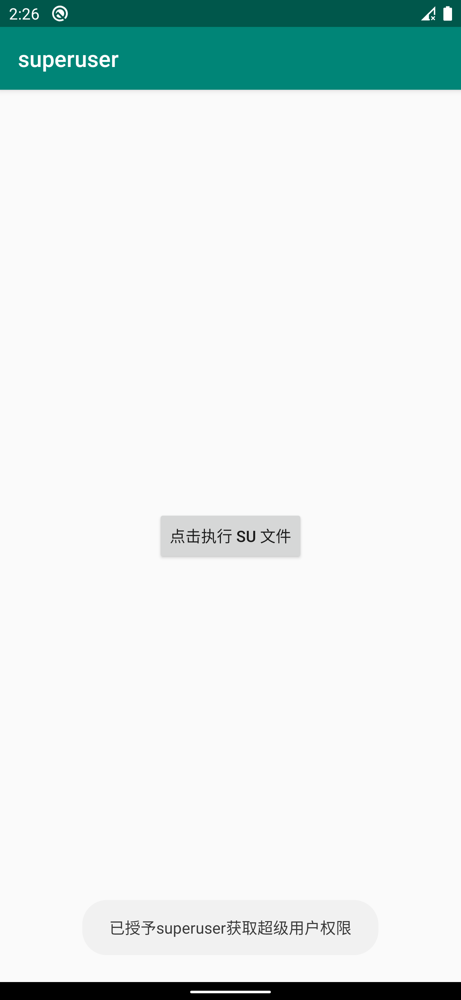

## 前言
这几天因为涉及到jni的开发，就对linux稍微有了一点点的了解。刚好很久没有写博客，干脆就简单实现下Android的su提权， 权当复习了。


## 知识点
* su daemon守护进程(server)的创建
* su被调用时client与server的通信
* client身份的认证与授权
* server运行client端命令

## 背景知识
android本质上还是基于linux开发的操作系统。在linux下，当需要提权时，可以很方便地通过 ` sudo ` 或 `su` 提权，进而完成高权限操作。
然而在android中，每个用户能做什么不能做什么已经在代码中写死了，默认没有`root`用户的存在，直接调用`su`肯定不行。
然而在日常的开发中，有时又需要一些高权限操作，这时我们通常采取的方案是在第三方`recovery`下
刷入`SuperSU` 包或者 `Magisk` 包这样的第三方`root`方案。

这些方案的核心操作都是在 `$PATH` 环境变量(通常是`/system/bin:/system/xbin:/sbin:/vendor/bin:/vendor/xbin`)
下放置一个`su`的可执行文件，当有程序调用`su`时，会触发权限申请操作，用户手动授权才会授予`root`权限。

如果是在linux下，只要给`su`文件以`suid`权限，实际运行时就自然是`root`身份了。然而在android中，很多分区在一开始挂载时就被设置为`no suid`，
因此这个方案自然行不通。如果直接观察 `su` 文件的权限，也是正常的`0755`权限，根本就没有`suid`位



所以一个可行的方案是，在设备启动时由`init`进程开启一个`su daemon` 守护进程，当有程序调用`su`时，
就作为`client`与这个`server`通信，由远程的`server`完成所有操作。
由于`init`进程具有天然的`root`权限，由它 fork 出的`su daemon`自然也是`root`身份，这就实现了提权。


## su daemon守护进程(server)的创建
由上述分析可知，守护进程应该由一个具有`root`身份的进程创建。在我的设备上，`/system/etc/init/superuser.rc`就是这个作用。我们来看一下它的内容
```
service su_daemon /system/xbin/su --daemon
    user root
    group root
    disabled 
    seclabel u:r:sudaemon:s0
```

所以在我们自己的`su`文件中，也可以判断`--daemon`这个参数，完成服务端的创建。服务端负责阻塞并接收客户端发来的`su`请求。
当成功接收时，就会`fork`出一个新的进程来完成请求。这是一个典型的跨进程通信(IPC)实例。这里使用socket通信。
关于socket，网上已经有很多文章了，因此不再赘述。

```C
int start_daemon();
int handle_client_socket(int server, int client);
void exec_su_args(struct ucred* cred, struct su_args* args);

int start_daemon()
{
    int fd = -1;
    int status = -1;

    if (getuid() != 0 || getgid() != 0) {
        LOGE("daemon must run with root user\n");
        goto bail;
    }
 
    struct sockaddr_un addr;

    if ((fd = open_local_server(LOCAL_SOCKET_PATH, &addr, 5)) == -1) {
        LOGE("failed to open local socket\n");
        goto bail;
    }

    LOGD("ok, now waiting for a new client socket ...\n");

    int client = accept(fd, NULL, NULL);
    status = handle_client_socket(fd, client);

bail:
    if (fd != -1) close(fd);
    unlink(LOCAL_SOCKET_PATH);
    return status;
}

int open_local_server(const char* path, struct sockaddr_un* addr, int block)
{
    int fd = -1;

    if (access(path, F_OK) == 0 && unlink(path)) {
        LOGE("can\'t remove existed unix socket channel: %s\n", path);
        goto bail;
    }
    
    if ((fd = socket(AF_UNIX, SOCK_STREAM|SOCK_CLOEXEC, 0)) == -1) {
        LOGE("failed when creating socket\n");
        goto bail;
    }

    addr->sun_family = AF_UNIX;
    strcpy(addr->sun_path, path);

    if (bind(fd, (struct sockaddr*) addr, sizeof(*addr)) == -1) {
        LOGE("failed when binding socket\n");
        goto bail;
    }

    if (listen(fd, block) == -1) {
        LOGE("failed when listening socket\n");
        goto bail;
    }

    chmod(path, 0666);

    LOGD("all things is done, return\n");
    return fd;
bail:
    if (fd != -1) close(fd);
    return -1;
}
```

需要说明的是，在接收客户端请求的 `accept` 函数处，应该设置一个死循环，这样才能一直接收新的请求。
这里只是为了原理性验证，因此接收一个请求就退出。

## su被调用时client与server的通信
既然通信方式已经确定，那么接下来就是通信内容，如要执行的命令，uid，以及当前环境变量与工作目录等。
我把这部分封装到一个`su_args`结构体中。client端在连接到server后，把`su_args`发送过去，自身陷入阻塞状态，等待server的返回值。

```C
struct su_args {
    uid_t uid;
    int argc;
    char args[512];
    // char[1024] cwd;
    // char[1024] path;
};

int start_client(struct su_argv* argv);
int handle_server_socket(int fd, struct su_args* args);
int open_local_client(const char* path, struct sockaddr_un* addr);

int start_client(struct su_args* args)
{
    int fd = -1;
    int status = -1;

    struct sockaddr_un addr;

    if ((fd = open_local_client(LOCAL_SOCKET_PATH, &addr)) == -1) {
        LOGE("failed when open client socket\n");
        goto bail;
    }

    if (connect(fd, (struct sockaddr*) &addr, sizeof(addr)) == -1) {
        LOGE("failed to connect to the server\n");
        goto bail;
    }

    status = handle_server_socket(fd, args);

bail:
    if (fd != -1) close(fd);
    return status;
}

int handle_server_socket(int fd, struct su_args* args)
{
    int status = -1;
    int bytes;

    LOGD("connect ok, now send su_args struct ...\n");

    if ((bytes = write(fd, args, sizeof(*args))) != sizeof(*args)) {
        LOGE("failed to send su_args struct\n"
            "expected %d bytes, actually %d bytes\n", (int) sizeof(*args), bytes);
        goto bail;
    }

    LOGD("send done, now waiting for exit code ...\n");
    if ((bytes = read(fd, &status, sizeof(int))) != sizeof(int)) {
        status = 1;
        LOGE("failed when receiving exit code\n");
        goto bail;
    }

    LOGD("exit code %d\n", status);
bail:

    return status; 
}

int open_local_client(const char* path, struct sockaddr_un* addr)
{
    int fd = socket(AF_UNIX, SOCK_STREAM|SOCK_CLOEXEC, 0);

    if (fd == -1) {
        LOGE("failed when creating socket\n");
        goto bail;
    }

    addr->sun_family = AF_UNIX;
    strcpy(addr->sun_path, path);

    LOGD("all things is done, return\n");
    return fd;
bail:
    if (fd != -1) close(fd);
    return -1;
}
```

## client身份的认证与授权
为了安全起见，服务端必须要能知道客户端的身份，即：uid，gid，pid等。这里就有两种选择了，一种是让client通过socket发过来，
一个是通过`getsockopt`函数。因为前种方式易被伪造，故选择后者。

```
    struct ucred cred;
    socklen_t len = sizeof(cred);
    getsockopt(client_fd, SOL_SOCKET, SO_PEERCRED, &cred, &len);
```

* 注意：这里需要提前 `#define _GNU_SOURCE`，否则会提示找不到`struct ucred` 

在获取客户端的身份之后，就需要判断是否要授权了。superuser的实现维护了一个sqlite3的数据库，
里面保存着所有的“白名单”与“黑名单”应用。如果发现数据库中没有对应app的记录时，才会通过对话框的方式，请求用户的授权。

su daemon与android app(superuser) 处在两个完全不同的运行环境里，一个是传统的linux进程，一个运行在java虚拟机上，
那么二者是怎么通信的呢？

答案是`am`命令。`am`是android内置的一个命令，可以实现在命令行环境下启动activity，service，发送广播等，使用十分广泛。
不了解的可以自行上网搜索，这里不再赘述了。

既然能够唤起android app，那么就要想办法接收数据返回。这里是创建了一个临时的socket来接收数据。
下面的代码在创建socket后倒计时20秒，如果因为各种各样的原因无法读到数据，那么直接拒绝。

```C
#define SUPERUSER_PACKAGE_NAME      "cn.nlifew.superuser"
#define SUPERUSER_REQUEST_ACTIVITY  ".ui.RequestActivity"

int start_request_activity(uid_t uid, pid_t pid)
{
    int status = -1;

    char uid_s[8];
    char path[32];
    sprintf(uid_s, "%d", uid);
    sprintf(path, "/dev/su.d.%d", pid);

    const pid_t child = fork();
    if (child == -1) {
        LOGE("failed to fork child process\n");
        return -1;
    }
    else if (child == 0) {
        execlp("am", "am", "start", 
            "-n", SUPERUSER_PACKAGE_NAME "/" SUPERUSER_REQUEST_ACTIVITY,
            "--ei", "caller_uid", uid_s,
            "--es", "socket_path", path,
            NULL);
        exit(errno);
    }

    waitpid(child, &status, 0);
    status = WEXITSTATUS(status);

    LOGD("am exit code %d\n", status);

    if (status != 0) {
        return -1;
    }

    int fd = -1;
    int client = -1;
    struct sockaddr_un addr;

    if ((fd = open_local_server(path, &addr, 1)) == -1) {
        LOGE("failed to open tmp socket: %s\n", path);
        return -1;
    }

    LOGD("socket ready, count 20 sec ...\n");

    fd_set fds;
    FD_ZERO(&fds);
    FD_SET(fd, &fds);

    struct timeval time = {
        .tv_sec     =   20,
        .tv_usec    =   0
    };

    if ((status = select(fd + 1, &fds, NULL, NULL, &time)) <= 0) {
        status = -1;
        LOGE("timeout, give up this socket \n");
        goto bail;
    }

    if ((client = accept(fd, NULL, NULL)) == -1) {
        LOGE("failed to accept client socket\n");
        goto bail;
    }

    if (read(client, &status, sizeof(status)) != sizeof(status)) {
        status = -1;
        LOGE("failed to read result data from client\n");
        goto bail;
    }
bail:
    unlink(path);
    if (fd != -1) close(fd);
    if (client != -1) close(client);
    return status;
}
```

在app端，我们可以通过解析参数，弹出一个对话框来请求操作，然后把结果写回到socket。

所以认证client的全部过程
```C
int handle_client_socket(int server_fd, int client_fd)
{
    int status = -1;

    struct su_args args;
    int bytes;

    if (client_fd == -1) {
        LOGE("invalid client fd: -1\n");
        goto bail;
    }

    LOGD("connect ok, now reading su_args ...\n");

    if ((bytes = read(client_fd, &args, sizeof(args))) != sizeof(args)) {
        LOGE("failed when reading struct su_args info\n"
            "expected %d bytes, actually %d bytes\n", (int) sizeof(args), bytes);
        goto bail;
    }

    LOGD("su_args = {uid = %d, args = %s}\n", args.uid, args.args);
    LOGD("done, check the client\n");

    struct ucred cred;
    socklen_t len = sizeof(cred);
    if (getsockopt(client_fd, SOL_SOCKET, SO_PEERCRED, &cred, &len)) {
        LOGE("failed to getsockopt\n");
        goto bail;
    }

    LOGD("ucred = {pid = %d, uid = %d, gid = %d}\n", cred.pid, cred.uid, cred.gid);
    LOGD("start superuser activity ...\n");

    status = start_request_activity(cred.uid, cred.pid);
    send_result_broadcast(cred.uid, status);

    if (status == -1) {
        LOGE("denyed by SuperUser app\n");
        goto bail;
    }

    pid_t child = fork();
    
    if (child == 0) {
        // 子进程
        close(client_fd);
        close(server_fd);
        exec_su_args(&cred, &args);
    }

    // 父进程
    LOGD("waiting child process %d ...\n", child);
    if (child != -1) waitpid(child, &status, 0);

    status = WEXITSTATUS(status);
    LOGD("exit code %d\n", status);

bail:
    if (write(client_fd, &status, sizeof(int)) != sizeof(int)) {
        LOGE("failed when send result code to the client\n");
    }
    if (client_fd != -1) close(client_fd);
    return status;
}
```

## server运行client端命令
这一部分实际上是server先fork出一个子进程，并委托子进程执行exec函数完成的。
父进程一直等待子进程的结束，并通过socket返回给客户端。这个过程需要接管client端的stdio设备。

```C
void exec_su_args(struct ucred* cred, struct su_args* args)
{
    int status = -1;

    LOGD("convert args\n");
    char** argv = split_cmd_line(args->args);
 
    LOGD("open remote stdio");

    char buff[64];
    int fin = -1, fout = -1, ferr = -1;

    sprintf(buff, "/proc/%d/fd/0", cred->pid);
    fin = open(buff, O_RDONLY);

    sprintf(buff, "/proc/%d/fd/1", cred->pid);
    fout = open(buff, O_WRONLY);

    sprintf(buff, "/proc/%d/fd/2", cred->pid);
    ferr = open(buff, O_WRONLY);

    if (fin == -1 || fout == -1 || ferr == -1) {
        LOGD("failed to open std\n");
        goto bail;
    }

    if (dup2(fin, 0) == -1 || dup2(fout, 1) == -1 || dup2(ferr, 2) == -1) {
        LOGD("failed to dup remote std\n");
        goto bail;
    }

    setuid(args->uid);
    chdir("/");
    execvp(argv[0], argv);

bail:
    if (fin != -1) close(fin);
    if (fout != -1) close(fout);
    if (ferr != -1) close(ferr);
    if (argv != NULL) free(argv);

    exit(status);
}
```

## 运行效果截图





## 注意事项
上面所述只是一个非常简单的实现，比如setsid会话组，android多用户，signal信号的处理等，这里都省略掉了。处理之外还有
* server的accept部分，应包裹在一个死循环中，这样才能一直接受请求
* superuser中有查询sqlite数据库的部分，这里省略了
* 在代理client端标准输入输出时，这里是直接open然后dup重定向文件描述符，superuser则用了虚拟终端，并开了子线程向远程转发
* main函数里把参数判断省略掉了
* 实际测试时要关闭selinux为宽容模式，否则socket连接不成功

**项目已托管到[github](https://github.com/nlifew/superuser)**